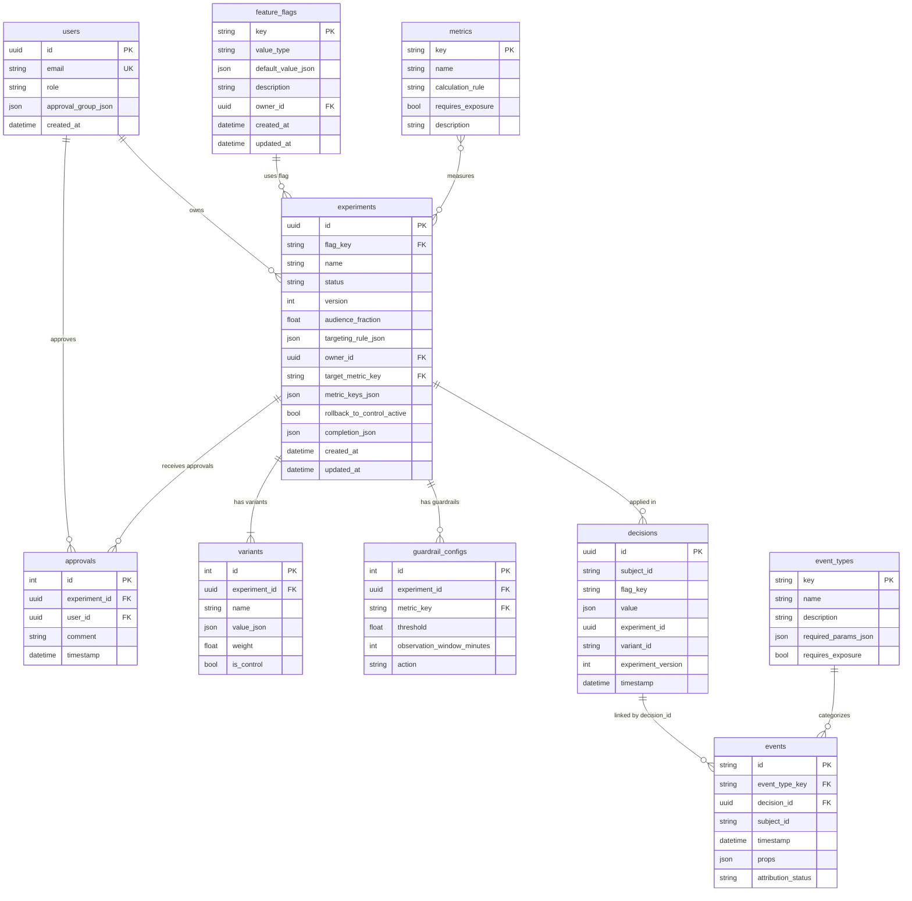

# База данных LOTTY A/B Platform

## Обзор

База данных спроектирована для поддержки всех основных функций платформы:
- Feature flags и управление конфигурацией
- Эксперименты и A/B тестирование
- Runtime решения (decision_log)
- События и атрибуция
- Каталоги метрик и типов событий
- Управление пользователями и ревью

**СУБД:** PostgreSQL (через asyncpg)  
**ORM:** Tortoise ORM  
**Миграции:** Aerich

---

## Почему subject_id: string, а не UUID?

**Из ТЗ (раздел 3.2):**
> **идентификатор субъекта** — стабильный идентификатор субъекта (например, **идентификатор пользователя или устройства**)

**Причины:**

1. **Гибкость интеграции**: продукт может использовать:
   - `device_id` (строка типа "DEVICE-ABC-123")
   - `external_user_id` (из внешней системы, не наш UUID)
   - `cookie_id`, `session_id` (строки)
   - Композитные ключи (например, "platform:user_id")

2. **Независимость от внутренней системы**: продукт не обязан использовать UUID платформы

3. **Детерминизм хеширования**: для decision_engine важна строковая стабильность

4. **Соответствие индустрии**: Google Optimize, LaunchDarkly, Optimizely — все принимают строковый user_id

**Вывод:** `subject_id: VARCHAR` правильно по ТЗ.

---

## ER-диаграмма

