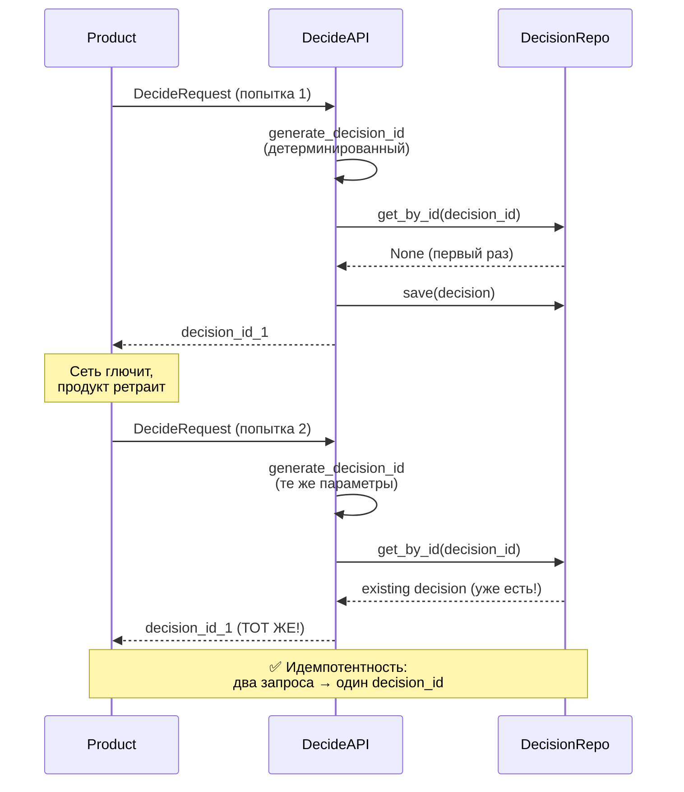

# Decision API: Анализ и подводные камни

## ✅ Что работает правильно

### 1. UUID/String типы корректны
- ✅ `Decision.id: UUID` (автогенерация через BaseEntity)
- ✅ `Decision.experiment_id: UUID | None`
- ✅ `Decision.subject_id: str` (по ТЗ 3.2)
- ✅ `Decision.variant_id: str` (имя варианта)
- ✅ `DecisionResponse.decision_id: str` (строка для JSON API)
- ✅ `DecisionResponse.experiment_id: str | None` (строка для JSON API)

### 2. Бизнес-логика соответствует ТЗ
- ✅ Детерминизм через SHA256 хеш
- ✅ Stickiness через (subject_id, experiment_id, version)
- ✅ Fallback на default когда эксперимент не применился
- ✅ Проверка статуса RUNNING (PAUSED → default)
- ✅ Проверка таргетинга
- ✅ Проверка audience_fraction
- ✅ Поддержка rollback_to_control

### 3. Сохранение решений для атрибуции
- ✅ Decision сохраняется в БД с variant_id
- ✅ События смогут найти решение по decision_id

## ⚠️ КРИТИЧЕСКИЙ подводный камень: Идемпотентность

### Проблема
```python
# UseCase сейчас:
decision = Decision(...)  # id = uuid4() КАЖДЫЙ РАЗ НОВЫЙ
await self._decisions_repository.save(decision)
```

**Сценарий проблемы:**
1. Продукт вызывает `POST /decide` → получает `decision_id_1`
2. Продукт рендерит UI с `decision_id_1`
3. Сеть глючит, продукт ретраит запрос
4. Второй вызов `POST /decide` → получает `decision_id_2` (другой UUID!)
5. Продукт отправляет событие с `decision_id_1` (старым)
6. ❌ Событие не найдётся в БД (там только decision_id_2)

### Что говорит ТЗ (3.5.3)
> Сеть — штука капризная: запросы и события могут теряться или дублироваться. Поэтому **идемпотентность** и дедупликация — обязательны.

### Решения

#### Вариант 1: Детерминированный decision_id (РЕКОМЕНДУЮ)
```python
import hashlib
from uuid import UUID

def generate_decision_id(
    subject_id: str,
    flag_key: str, 
    experiment_id: UUID | None,
    variant_id: str | None,
    timestamp_day: str  # YYYY-MM-DD
) -> UUID:
    """Генерирует детерминированный UUID для решения.
    
    Одинаковые параметры в рамках одного дня → один decision_id.
    """
    seed = f"{subject_id}:{flag_key}:{experiment_id}:{variant_id}:{timestamp_day}"
    h = hashlib.sha256(seed.encode()).digest()
    return UUID(bytes=h[:16], version=4)

# В usecase:
timestamp = datetime.utcnow()
timestamp_day = timestamp.date().isoformat()

decision_id = generate_decision_id(
    subject_id=data.subject_id,
    flag_key=data.flag_key,
    experiment_id=experiment_id,
    variant_id=variant_id,
    timestamp_day=timestamp_day,
)

# Проверяем, есть ли уже такое решение
existing = await self._decisions_repository.get_by_id(str(decision_id))
if existing:
    return DecideResponse(decision=to_dto(existing))

# Создаём новое с заданным id
decision = Decision(
    id=decision_id,  # Передаём явно!
    subject_id=data.subject_id,
    ...
)
```

**Плюсы:**
- ✅ Идемпотентность: повторный запрос → тот же decision_id
- ✅ Кеширование: можно не писать в БД повторно
- ✅ Consistency: одно решение = один decision_id

**Минусы:**
- ⚠️ Если пользователь видит разные варианты в течение дня (из-за изменения эксперимента), decision_id будет одинаковым

#### Вариант 2: Upsert по композитному ключу
```python
# Сохраняем с композитным уникальным индексом
# (subject_id, flag_key, timestamp_day)
# И возвращаем существующий, если есть
```

#### Вариант 3: Idempotency key от клиента
```python
class DecideRequest(BaseModel):
    subject_id: str
    flag_key: str
    attributes: dict[str, Any]
    idempotency_key: str | None = None  # Клиент передаёт свой ключ
```

## ⚠️ Второстепенные проблемы

### 1. `get_active_by_flag_key` возвращает PAUSED
```python
# ExperimentsRepositoryPort
def get_active_by_flag_key(self, flag_key: str) -> Experiment | None:
    # Должен возвращать ТОЛЬКО RUNNING, не PAUSED!
```

**Сейчас:**
- `experiment.status.is_active()` возвращает `True` для RUNNING **И PAUSED**
- Decision engine проверяет `status == RUNNING`, но лучше отфильтровать в репозитории

### 2. Отсутствие experiment_version в Decision
```python
# Decision сейчас:
experiment_id: UUID | None
variant_id: str | None
# НЕТ: experiment_version: int

# Если эксперимент изменил версию, мы потеряем контекст
```

**Рекомендация:** Добавить `experiment_version: int | None` в Decision для полной историчности.

### 3. Строковый experiment_id в DecisionResponse
```python
# Сейчас в usecase:
experiment_id=str(experiment_id) if experiment_id else None

# Это правильно для JSON API, но нужно быть аккуратным с преобразованиями
```

## 📊 Рекомендации по приоритетам

### 🔴 Критично (сделать до демо)
1. **Идемпотентность decision_id** — вариант 1 (детерминированный UUID)
2. **Проверить get_active_by_flag_key** — должен возвращать ТОЛЬКО RUNNING

### 🟡 Важно (сделать до продакшена)
1. Добавить `experiment_version` в Decision
2. Добавить дедупликацию решений в репозитории
3. Логирование конфликтов (когда decision_id уже существует)

### 🟢 Желательно
1. Мониторинг частоты ретраев
2. Метрики по decision_id collisions
3. TTL для старых решений в БД

## Диаграмма потока с идемпотентностью



## Итоговая оценка

| Критерий | Статус | Комментарий |
|----------|--------|-------------|
| UUID типы | ✅ | Всё правильно |
| Бизнес-логика | ✅ | Соответствует ТЗ 3.4 |
| Детерминизм | ✅ | SHA256 хеш работает |
| Stickiness | ✅ | Через (subject_id, exp_id, version) |
| Идемпотентность | ❌ | **КРИТИЧНО: новый UUID каждый раз** |
| Сохранение решений | ✅ | В БД с variant_id |
| Fallback на default | ✅ | Правильно |
| PAUSED → default | ✅ | В decision_engine проверяется |
| rollback_to_control | ✅ | Поддерживается |

**Общая оценка:** 8/10
**Блокирует продакшен:** Идемпотентность decision_id
