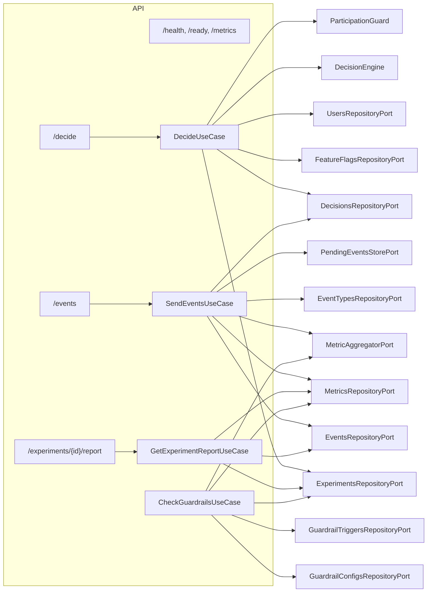

# C4 Component — API контейнер (crit path: decide → event → report/guardrail)

**Пояснения по компонентам:**

- `decideRoute` (`/decide`) — HTTP-слой (FastAPI router), принимает `DecideRequest` и отдаёт `DecideResponse`.
- `DecideUseCase` — прикладной слой, который:
  - загружает флаги и активные эксперименты по ключам;
  - принимает решение через `DecisionEngine` с учётом таргетинга и весов;
  - проверяет политику участия пользователя в экспериментах через `ParticipationGuard`;
  - сохраняет `Decision` в репозитории и возвращает детерминированный `decision_id`.
- `eventsRoute` (`/events`) — принимает батч событий, вызывает `SendEventsUseCase`.
- `SendEventsUseCase`:
  - парсит и валидирует события;
  - проверяет тип и обязательные поля (через `EventTypesRepositoryPort` и валидатор);
  - выполняет дедупликацию;
  - атрибутирует события к решениям/экспериментам;
  - обновляет агрегаты метрик через `MetricAggregatorPort`.
- `reportsRoute` (`/experiments/{id}/report`) — HTTP-слой над `GetExperimentReportUseCase`.
- `GetExperimentReportUseCase`:
  - загружает эксперимент и его варианты;
  - собирает атрибутированные события по эксперименту и вариантам;
  - рассчитывает метрики и динамику по дням;
  - возвращает отчёт по эксперименту в разрезе вариантов и общий блок `overall`.
- `checkGuardrailsUseCase` — прикладной слой, который:
  - по запущенным экспериментам и конфигам guardrails берёт метрики через `MetricAggregatorPort`;
  - сравнивает значение с порогом;
  - при превышении создаёт `GuardrailTrigger`, обновляет статус эксперимента и публикует доменное событие.

Компоненты хранилищ (`*RepositoryPort`, `PendingEventsStorePort`, `MetricAggregatorPort`) реализуются в инфраструктурном слое (`src/infra/adapters/...`) и взаимодействуют с PostgreSQL/Redis/OpenSearch, но на данной диаграмме не детализируются.

