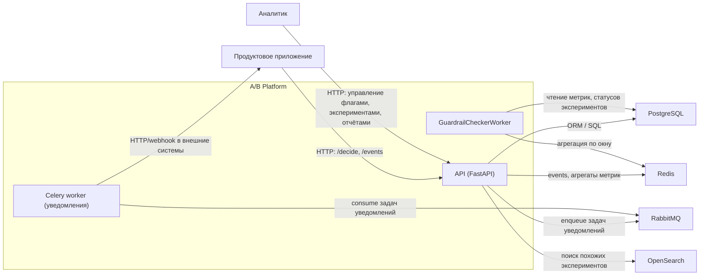

# C4 Container — A/B Platform

**Пояснения по контейнерам:**

- `API (FastAPI)` — основной HTTP-сервис:
  - `/decide` — выдача значений флагов и `decision_id` для субъекта;
  - `/events` — приём батча событий, валидация, дедупликация, атрибуция;
  - `/experiments/*` — управление экспериментами, статусами, guardrails;
  - `/experiments/{id}/report` — построение отчёта по эксперименту;
  - `/health`, `/ready`, `/metrics` — эксплуатационные эндпоинты.
- `GuardrailCheckerWorker` — фоновой воркер (логический контейнер внутри процесса API), который:
  - периодически запускает usecase `CheckGuardrailsUseCase`;
  - читает метрики и конфиги guardrails;
  - при срабатывании обновляет статус эксперимента и публикует доменные события.
- `Celery worker` — отдельный процесс для доставки уведомлений в Telegram/Slack и другие каналы.
- `PostgreSQL` — хранилище флагов, экспериментов, решений, событий, метрик, конфигов guardrails и триггеров.
- `Redis` — хранение pending-событий, временных агрегатов метрик и прочих быстрых структур данных.
- `OpenSearch` — индекс learnings (история экспериментов, поиск похожих).
- `RabbitMQ` — брокер сообщений для очереди уведомлений.

