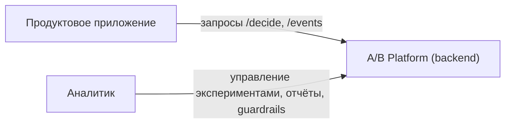

# C4 Context — A/B Platform

**Пояснения:**

- `productApp` — любое клиентское приложение (web/mobile/backend), которое:
  - запрашивает решения по флагам через `/decide`;
  - отправляет события (показы, конверсии, ошибки, латентность) через `/events`.
- `analystUser` — аналитик или продакт-менеджер, который:
  - создаёт и настраивает флаги, эксперименты, guardrails;
  - просматривает отчёты `/experiments/{id}/report`;
  - анализирует результаты и принимает решения (`rollout/rollback/no_effect`).
- `abPlatform` — реализуемый backend, отвечающий за:
  - детерминированную выдачу вариантов по флагам;
  - приём и атрибуцию событий;
  - вычисление метрик и отчётов;
  - автоматические safety-механики (guardrails).

