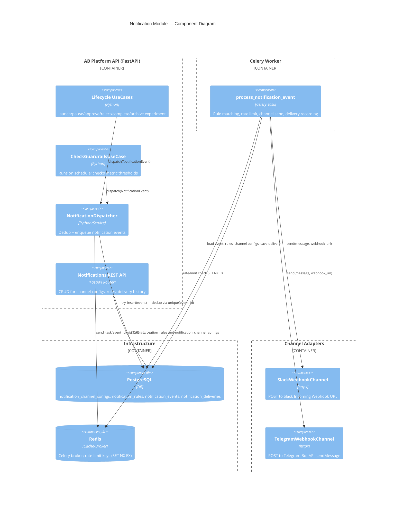
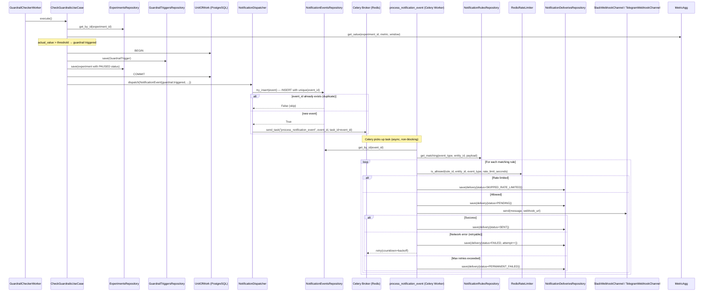

# Notification Platform — Architecture

## Overview

The Notification Platform reacts to experiment lifecycle events and guardrail triggers,
delivering messages to configured channels (Slack, Telegram) via webhooks.

**Key properties:**
- Production-ready: deduplication, idempotent delivery, retriable sends, error logging.
- Scalable: background processing via Celery workers, decoupled from the API request path.
- Extensible: adding a new channel (e.g. Email) requires only a new adapter + DI registration — no core logic changes.
- Rate-limited per `(rule_id, entity_id, event_type)` via Redis atomic SET NX EX.

---

## C4 Component Diagram — Notification Module



---

## Sequence Diagram: GuardrailTriggered → Notification



---

## Deduplication Strategy

Without the Outbox pattern (per project requirements), the following two-level deduplication is used:

1. **Event-level dedup** (`notification_events.id` — primary key = deterministic UUID5):
   - Generated as `uuid5(NAMESPACE, f"{event_type}:{entity_id}:{version}")`.
   - `try_insert()` uses the unique PK to silently no-op on duplicate inserts.
   - If the insert fails (duplicate), the dispatcher does NOT enqueue the Celery task.

2. **Delivery-level idempotency** (`notification_deliveries` unique on `(event_id, rule_id)`):
   - Even if the Celery task runs twice (rare: duplicate enqueue, worker restart), it checks the existing delivery record and skips `SENT` ones.

**Known limitation (FX-2):** If the application crashes between the DB `INSERT INTO notification_events` commit and the `celery.send_task()` call, the event is persisted but the Celery task is never enqueued. This event will be silently lost unless:
- A periodic reconciliation job is added (not implemented) to re-enqueue unprocessed events.
- The Outbox pattern is adopted (explicitly excluded by project requirements).

---

## Rate Limiting

- Redis key: `notif:rl:{rule_id}:{entity_id}:{event_type}`
- Atomic: `SET key 1 NX EX {rate_limit_seconds}` — first call acquires the lock, subsequent calls within the window are blocked.
- `rate_limit_seconds = 0` disables rate limiting for a rule.
- On rate-limited delivery, a `NotificationDelivery` record is saved with `status = SKIPPED_RATE_LIMITED` for audit purposes.

---

## Adding a New Channel (e.g. Email)

1. Create `src/infra/adapters/channels/email_channel.py` implementing `NotificationChannelPort`.
2. Add `EMAIL = "email"` to `NotificationChannelType`.
3. Register in `src/infra/tasks/notifications.py`'s `channel_registry`:
   ```python
   channel_registry = {
       NotificationChannelType.SLACK: SlackWebhookChannel(),
       NotificationChannelType.TELEGRAM: TelegramWebhookChannel(),
       NotificationChannelType.EMAIL: EmailChannel(smtp_config=...),
   }
   ```
4. **No changes needed** to domain logic, dispatcher, or repositories.
